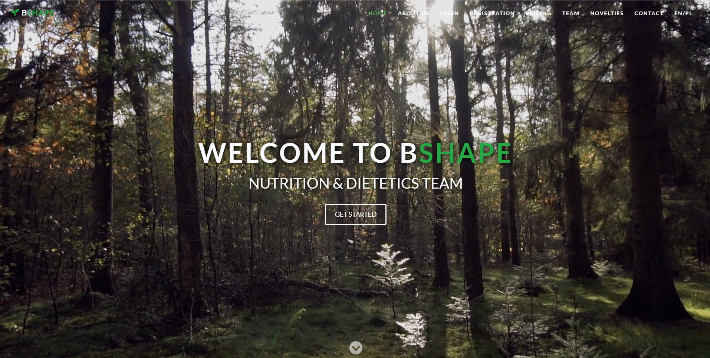
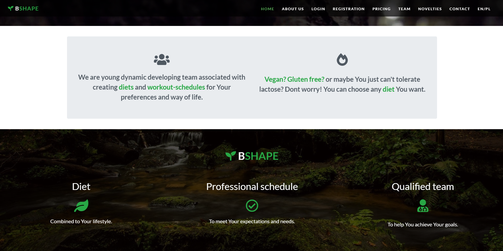
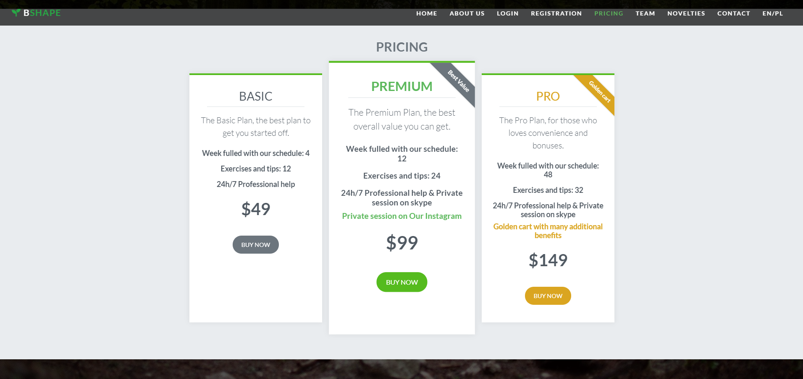
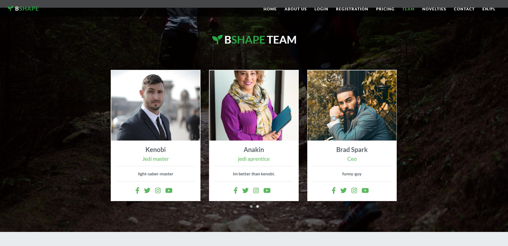
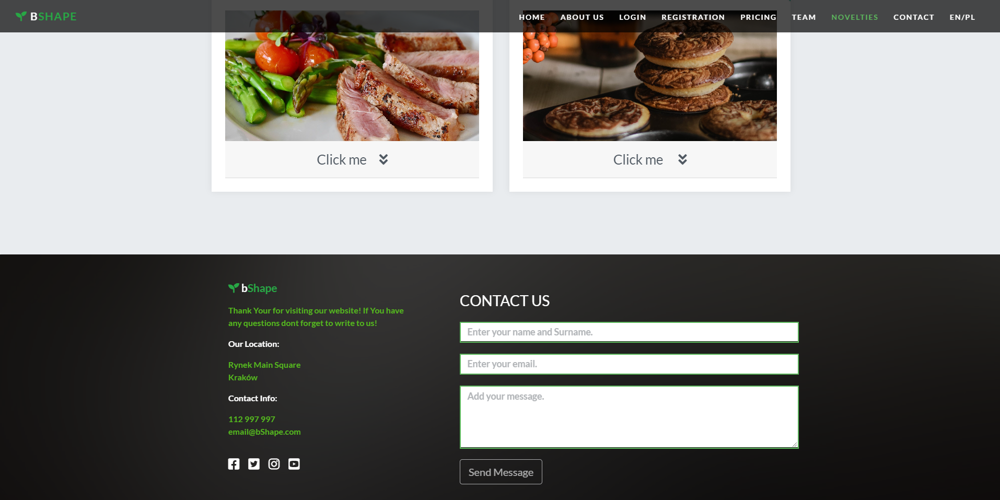

## About Aplication:
`
The aim of the project is to create a view for a web application that will serve as a business card page for an android application.
Project made in collaboration with Mykola Diedugh.
`
`
Current development status of the application on the branch called - develop on Mykola Diedugh's Repository 
https://github.com/MykolaDiedukh/bShapeAngular
Project status: work in progress
`

## Functionalities:

`
- loggining in
- registration
`
`

## Languages and Tools Used:
`
- JavaScript
- TypeScript
- Bootstrap
- jQuery
- CSS
- MySQL
- Git
- Trello
`


## Job distribution tools:


`
`

## Page layout:


`
`

`
`

`
`

`
`

`
`

`
````
